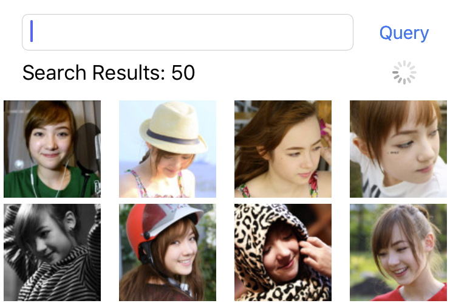
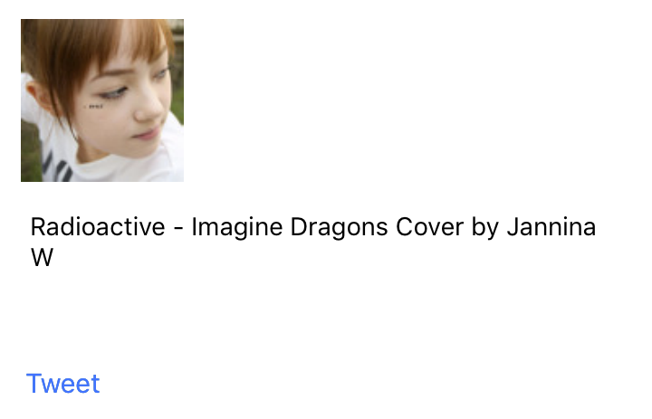
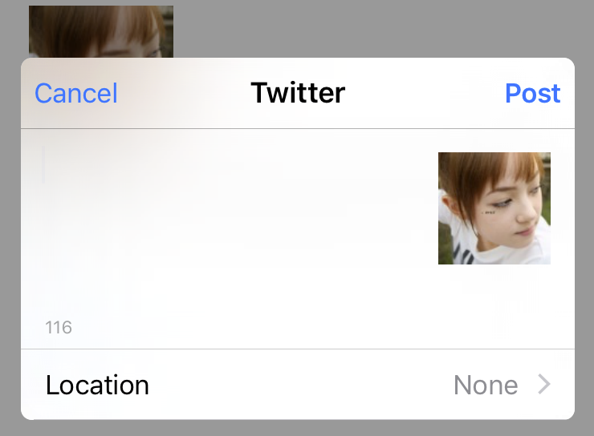
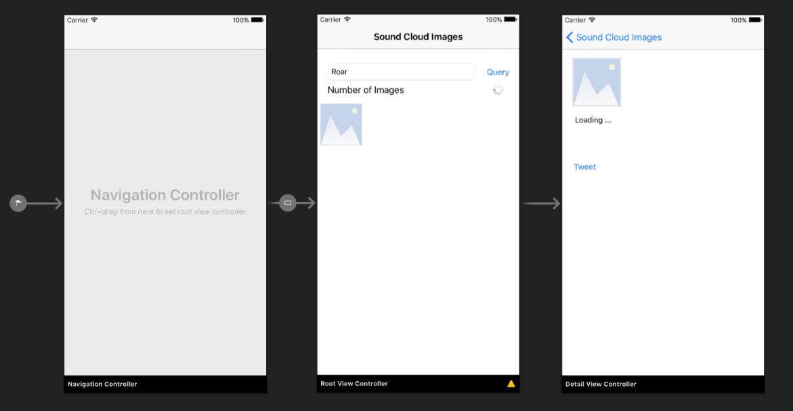

## แสดง Image โดยใช้ Collection View

### RootViewController

    

### DetailViewController

    

### Tweet

    

## สร้าง Story Board

    

1. RootViewController - RootViewController.cs
2. DetailViewController - DetailViewController.cs

## RootViewController

- `RootViewController` extend `IUICollectionViewSource` เพิ่อให้สามารถเรนเดอร์รูปภาพ ใน `CollectionView` ได้
- ต้องอิมพลีเมนต์ `GetCell` และ `GetImageCount` (ของ `IUICollectionViewSource`)
- `ViewDidLoad` มีการเซ็ต `WeakDataSource` ของ `CollectionView` ชื่อ `ImageCollection` เป็น `this`
- `GetCell` มีการ Assign Source ของ Image ที่ต้องการแสดงโดยดึงมาจาก Property ชื่อ `Images` ของ `BingHelper`
- `QueryButton_TouchUpInside` มีการ Reload ข้อมูลจาก Server และ Refresh `ImageCollection`
- `PrepareForSegue` มีการ Assign ค่า Image และ Detail เพื่อให้ไปแสดงที่ `DetailViewController`

```csharp
public partial class RootViewController : UIViewController, IUICollectionViewSource
{
    private BingHelper _helper;

    public RootViewController (IntPtr handle) : base (handle)
    {
        _helper = new BingHelper ();
    }

    public override void ViewDidLoad ()
    {
        base.ViewDidLoad ();
        ImageCollection.WeakDataSource = this;
    }

    partial void QueryButton_TouchUpInside (UIButton sender)
    {
        StartQuery (KeywordTextBox.Text);
    }

    async void StartQuery (String keyword)
    {
        ProgressIndicator.StartAnimating ();
        await _helper.QuerySoundClound (keyword);
        NumberOfImagesLabel.Text = "Search Results: " + _helper.Images.Count;
        ImageCollection.ReloadData ();
        ProgressIndicator.StopAnimating ();
    }

    public override void PrepareForSegue (UIStoryboardSegue segue, NSObject sender)
    {
        base.PrepareForSegue (segue, sender);
        var vc = (DetailViewController)segue.DestinationViewController;
        var cell = (ResultImageCell)sender;
        vc.TheImage = cell.TheImage.Image;
        vc.Detail = cell.Detail;
    }

    public UICollectionViewCell GetCell (UICollectionView collectionView, NSIndexPath indexPath)
    {
        var cell = (ResultImageCell)collectionView.DequeueReusableCell ("image", indexPath);
        var result = _helper.Images [indexPath.Row];
        cell.TheImage.SetImage (
            url: new NSUrl (result.MediaUrl)
        );
        cell.Detail = result.Title;
        return cell;
    }

    public nint GetItemsCount (UICollectionView collectionView, nint section)
    {
        return (nint) _helper.Images.Count;
    }
}
```

## DetailViewController

```csharp
public partial class DetailViewController : UIViewController
{
    public UIImage TheImage { set; get; }
    public string Detail { set; get; }

    public DetailViewController (IntPtr handle) : base (handle)
    {
    }

    partial void TweetButton_TouchUpInside (UIButton sender)
    {
        var tweet = new Twitter.TWTweetComposeViewController ();
        tweet.AddImage (TheImage);
        PresentViewControllerAsync (tweet, true);
    }

    public override void ViewDidAppear (bool animated)
    {
        base.ViewDidAppear (animated);
        TweetImage.Image = TheImage;
        TweetDetail.Text = Detail;
    }
}
```